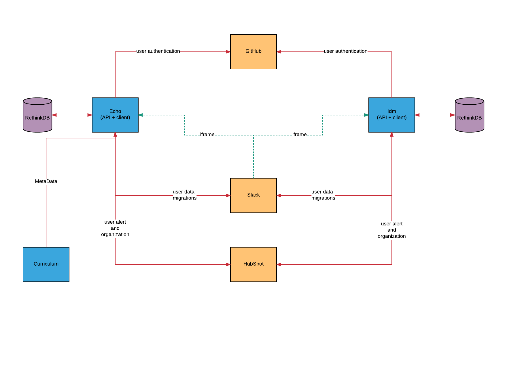

# Architecture

Everything we build conforms the principles of [service-oriented-architectures](../global-requirements/soa.md)

## Key Services

### Internal services

#### idm (Identity Management)

- **Domains:** user data
- **Accountabilities:** SSO, authentication, authorization, user data APIs
- **Endpoint:** https://idm.learnersguild.org
- **Repository:** https://github.com/LearnersGuild/idm

#### echo

- **Domains:** phases, members, projects, goals
- **Accountabilities:** chapter membership, project team assignment, project goal assignment, member phase tracking
- **Endpoint:** https://echo.learnersguild.org
- **Repository:** https://github.com/LearnersGuild/echo

#### graphiql

- **Accountabilities:** graphiql interface w/ all LOS services having a GraphQL API
- **Endpoint:** https://graphiql.learnersguild.org
- **Repository:** https://github.com/LearnersGuild/graphiql

#### curriculum

- **Domains:** guide, phases, modules, skills, cos, users, calendar
- **Accountabilities:** learners guide, phase list, module list, skills tracking, users list
- **Endpoint:** https://curriculum.learnersguild.org
- **Repository:** https://github.com/GuildCrafts/curriculum

### External services

#### GitHub

- **Domains:** user authentication
- **Accountabilities:** third-party authentication of IDM account holders
- **Endpoint:** https://api.github.com

#### Slack (Chat)

- **Domains:** real-time chat among members, integration with Echo service
- **Accountabilities:** real-time chat, single-sign-on, custom `/slash` commands
- **Endpoint:** https://learnersguild.slack.com

#### HubSpot

- **Domains:** alerts, individual deadlines, non-coding related information
- **Accountabilities:** end-to-end guild membership tracking
- **Endpoint:** https://api.hubspot.com

### Key Libraries

#### echo-cli (Echo CLI Command Parser)

- **Domains:** commands and command-line options
- **Accountabilities:** command-line option parsing, API invocations, and error handling
- **Repository:** https://github.com/LearnersGuild/echo-cli

#### idm-jwt-auth (Node.js IDM Helpers)

- **Accountabilities:** SSO for Node.js apps
- **Repository:** https://github.com/LearnersGuild/idm-jwt-auth
