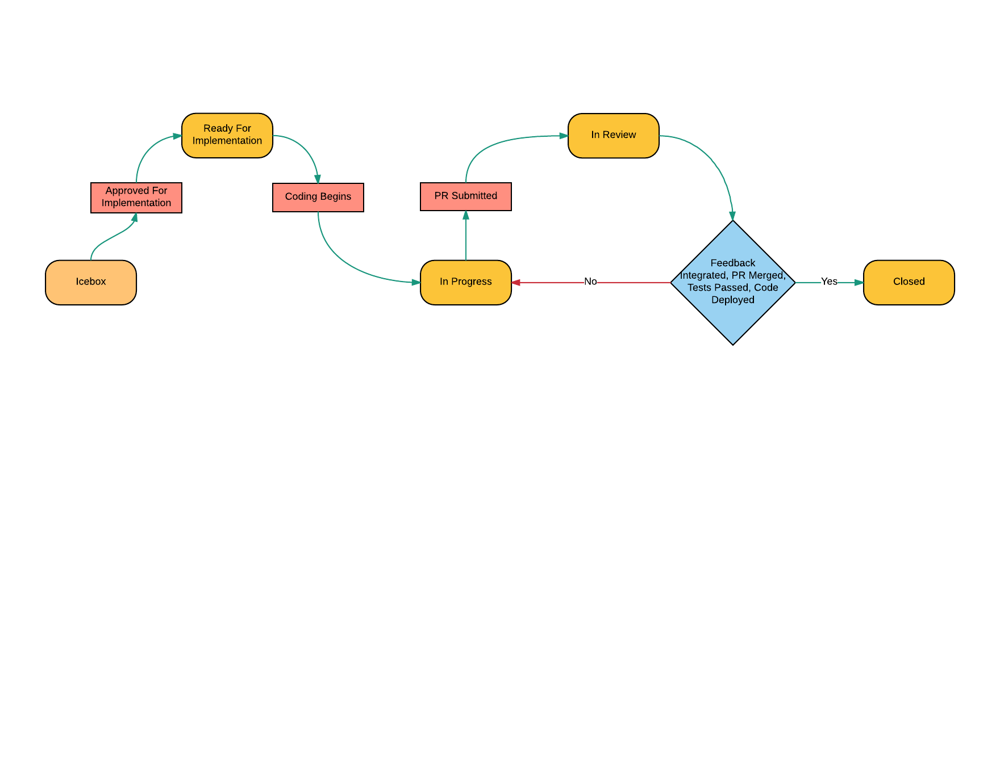
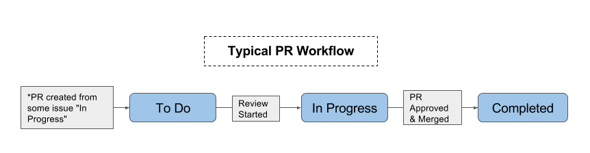

# Software Development Process

Our software development process has two distinct phases, design / prototype and implementation. Each of these phases is tracked on its own [ZenHub][zenhub] board. Issues on each board move from left to right as they are being developed.

## The Lifecycle of an Issue

In certain cases, issues will begin their life on the [Implementation Board][implementation-board]. For example, issues related to bugs, addressing technical debt, or "one off" things that don't require design.

Most of the time, however, will start on the [Design / Prototype Board][design-prototype-board]. During this phase, system mechanics are developed, the user experience and interface is designed, and engineering (as well as other stakeholders) have a chance to provide feedback on the design, raising any flags that could be problematic later. Once the review feedback has been digested (and potentially integrated), issues become "Ready for Implementation", and it is at this point that the issue moves from the [Design / Prototype Board][design-prototype-board] to the [Implementation Board][implementation-board].

The lifecycle of a typical issue on the board looks something like this:

### Issue Implementation

When we actually start coding, we use [GitHub Flow][github-flow] to do so, which means that most work ends up with a pull request being submitted. The lifecycle of pull request on the board looks something like this:

<!--
  The flowchart images can be edited here:
  https://docs.google.com/a/learnersguild.org/presentation/d/1P2jYADEsBalKP0i5A2zLiw-zyC8gv1iwXIcyudL9WpU/edit?usp=sharing
-->

## Project Board and Pipeline                                               |

### Implementation

The [Implementation Board][implementation-board] has the following pipeline:

| Pipeline      | Description                                                                   |
|:--------------|:------------------------------------------------------------------------------|
| New Issues    | Like it says on the tin ;-)                                                   |
| Backlog       | A prioritized list of issues with adequate requirements ready to be developed |
| In Progress   | Work being done right now                                                     |
| Review        | Issues waiting for peer review and merging                                    |
| Closed        | Completed Issues and closed PR's                                              |

<!-- links -->

[zenhub]: https://www.zenhub.com/
[github-flow]: https://guides.github.com/introduction/flow/
[project-board]: https://github.com/LearnersGuild/echo#boards
